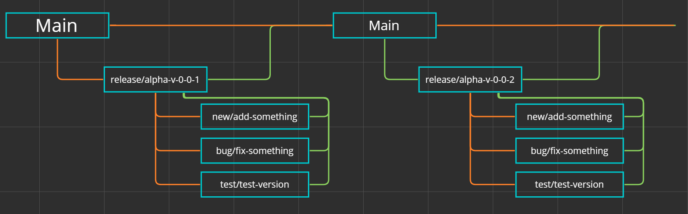

# 情報
- 分かりやすい名前を使用すること。
- 説明を簡潔で分かりやすく書くこと。

# ブランチ戦略
- 以下の画像に示すとおりにします。
- ブランチ名は、`カテゴリ/内容`とします。



# コードレビューの実施
- PullRequest前に変更のレビュー（`InReview`）を行います。
- `InReview`とは、変更が正しく行われているか、コンフリクトが起こっていないかをチェックする段階のことを言います。
- このレビューが終わり、`PullRequestQue`段階に移行するよう連絡された場合に`PullRequest`を行ってください。

# 問題追跡とタスク管理
- 問題追跡は、私たちがデバッグした際に発見したものと、ユーザーがプレイしていた際に発見したものに限定します。
- 問題追跡は、GitHubの`issue`機能を使用します。
- タスク管理は、GitHubの`Project`機能を使用します。

# ライセンスの明示
- 全ての成果物にライセンスを記述してください。フォーマットは以下です。
```
Copyright (c) ProjectTerra All rights reserved.

Created by <GitHub-Username> in yyyy/mm/dd
```
- ただし、全ての成果物は[`copyrights-rules`](./copyrights-rules.md)に従います。
